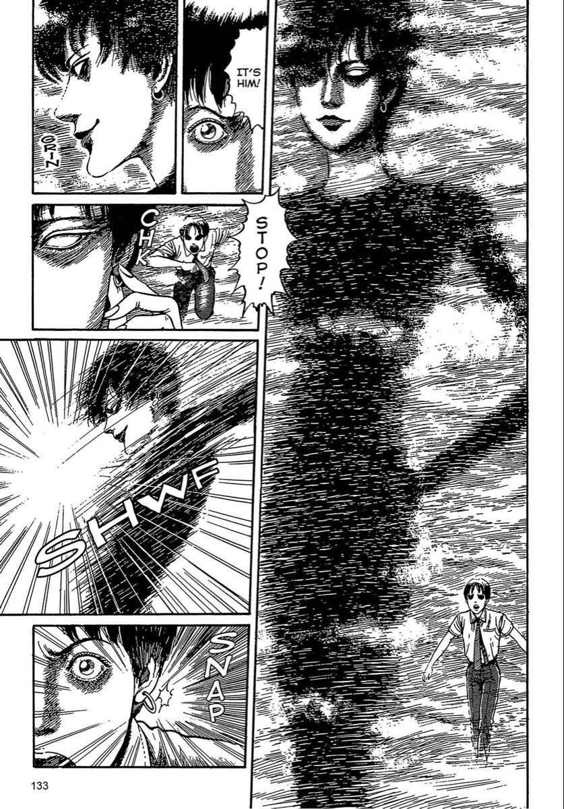
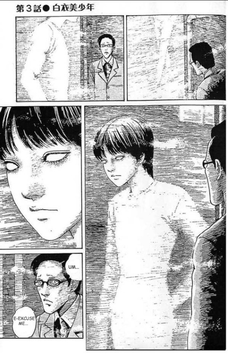

<h1 align="center">
    
</h1>

<h2 align="center">
   A programmer who is interested in all things occult!✨🔮🌠🃏🌟
</h2>

 🔭 I’m currently working on **My Leetcode Journey**

 🌱 I’m currently learning **Data structures and algorithms**
 

<h3 align="center">
<i>You can be a late bloomer and still be the most beautiful flower in the garden</i> 🌸
</h3>

 

<h2 align="center">⚒️ Languages-Frameworks-Tools ⚒️</h2>
 

    
     

 

<!-- * Dark Theme Snake Game -->

  <h2>🐍 My Contributions 🐍</h2>
   
<picture>
  <source
    media="(prefers-color-scheme: dark)"
    srcset="https://raw.githubusercontent.com/StevenWanglolz/StevenWanglolz/output/github-contribution-grid-snake-dark.svg"
  />
  <source
    media="(prefers-color-scheme: light)"
    srcset="https://raw.githubusercontent.com/StevenWanglolz/StevenWanglolz/output/github-contribution-grid-snake.svg"
  />
  
</picture>

<!-- * Light Theme Snake Game

  <h2>🐍 My Contributions 🐍</h2>
   
  

     

-->

<h2 align="center">⚡ Stats ⚡</h2>

---

## Projects I've participated in

- Garmin app that tracks users' data and allows users to log their emotion (Repository kept private) - _Swift_
- [Online school resource sharing website, KnowledgeNCU](https://github.com/StevenWanglolz/112_SA_project_G2) (Although I did not contribute much to this project due to some issues with my computer.) - _html, css, javascript, java, sql (xampp)_
- [My own Leetcode solutions](https://github.com/StevenWanglolz/My_Leetcode_Journey) - _Python, C++_

## Fun facts about me

- I major in MIS.
- I am interested in the occult, e.g., Numerology, Astrology, Witchcraft, ESP, Tarot, Spirituality, all things occult.
- My music taste is very different from my peers. I listen to a lot of [Beabadoobee](https://www.youtube.com/@Beabadoobee), [Mitski](https://www.youtube.com/@mitskileaks), [Chloe Moriondo](https://www.youtube.com/@chloemoriondo), and [Bruno Major](https://www.youtube.com/@MrBrunoMajor), etc.
- I was the top 0.1% of [Beabadoobee](https://www.youtube.com/@Beabadoobee) listeners in 2022.
- I am a big fan of [Junji Ito](https://www.google.com/search?q=junji+ito&rlz=1C1ONGR_zh-TWTW1063TW1063&oq=junji+ito&gs_lcrp=EgZjaHJvbWUqDAgAECMYJxiABBiKBTIMCAAQIxgnGIAEGIoFMgwIARAuGEMYgAQYigUyBggCEEUYOzIMCAMQLhhDGIAEGIoFMgcIBBAAGIAEMgcIBRAAGIAEMgcIBhAuGIAEMgcIBxAAGIAEMgcICBAuGIAEMgcICRAAGIAE0gEIMTcwMmowajeoAgCwAgA&sourceid=chrome&ie=UTF-8).
- I love [Albert Camus](https://www.google.com/search?q=albert+camus&sca_esv=b72e1409803a6609&rlz=1C1ONGR_zh-TWTW1063TW1063&sxsrf=ACQVn09Gf8hBau6dFIs6N8WrvCAY2yQK7A%3A1707407301455&ei=xffEZaurG4iYvr0PpL6K4AM&ved=0ahUKEwjrocLti5yEAxUIjK8BHSSfAjwQ4dUDCBA&uact=5&oq=albert+camus&gs_lp=Egxnd3Mtd2l6LXNlcnAiDGFsYmVydCBjYW11czIFEC4YgAQyChAuGIAEGIoFGEMyBRAuGIAEMgUQABiABDIFEAAYgAQyBRAuGIAEMgUQLhiABDIFEAAYgAQyBRAuGIAEMgUQABiABDIUEC4YgAQYlwUY3AQY3gQY4ATYAQJI6xhQ_QNYlhhwAngBkAEAmAF_oAHACaoBBDEyLjK4AQPIAQD4AQGoAhTCAgoQABhHGNYEGLADwgINEAAYgAQYigUYQxiwA8ICChAjGIAEGIoFGCfCAgoQABiABBiKBRhDwgIKEAAYgAQYFBiHAsICCBAuGIAEGNQCwgIHECMY6gIYJ8ICExAAGIAEGIoFGEMY6gIYtALYAQHCAhAQLhiABBiKBRhDGMcBGNEDwgILEC4YgAQYxwEY0QPCAgsQABiABBiKBRiRAsICGRAuGIAEGIoFGEMYlwUY3AQY3gQY3wTYAQLCAgsQLhiABBjHARivAcICBxAuGIAEGAriAwQYACBBiAYBkAYKugYGCAEQARgBugYGCAIQARgU&sclient=gws-wiz-serp). I've read "The myth of Sisyphus."
- I like to write poems. [My Poetry Account](https://www.instagram.com/rayofhope_inthedark?igsh=bXFtYWt3MmhsZXdi&utm_source=qr)
- The images below will give you an idea of what I look like :3

!

<h1 align="center">
    
</h1>
